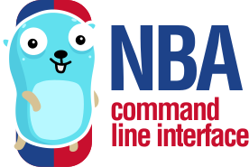

<div align='center'>


`nbacli` is a command line interface for NBA games.

<p>
  
  
</p>
</div>

## ⚡️ Features

🏀 Get the latest scores for NBA games

📊 Get the stats for a specific games

⛹️ Much more is yet to come - stay tuned!

## ⚙️ Installation

### Binaries

Binaries are available for Linux, macOS, and Windows. You can download the latest version from the [releases page](https://github.com/dylantientcheu/nbacli/releases).

### From source

```bash
git clone https://github.com/dylantientcheu/nbacli.git && cd nbacli

# insall
go install

# run
nbacli games
```

> **Note**
> When building from source, make sure that `$GOPATH/bin` is in your `PATH` environment variable and
> that you are using the latest version of [`less`](http://greenwoodsoftware.com/less/).

### Homebrew

```bash
brew tap dylantientcheu/nbacli && brew install nbacli

# run
nbacli games
```

## 📖 Usage

### Get the latest scores

```bash
nbacli games
```

<small>Navigate through the games using the <kbd>↑</kbd> arrow keys <kbd>↓</kbd> and press <kbd>Enter</kbd> to get the stats for a specific game.</small>

#### Get the stats for the day before

```bash
nbacli games --yesterday
```

#### or the day after

```bash
nbacli games --tomorrow
```

### Get the games for a specific date

```bash
nbacli games --date YYYYMMDD
```

## ⌨️ Under the hood

* Data is fetched from [stats.nba.com](https://stats.nba.com) using a [custom version](./nag/) of [nag](https://github.com/ronaudinho/nag)
* The CLI is built using [Cobra](https://github.com/spf13/cobra)
* TUI is sweetened with [Bubble Tea](https://github.com/charmbracelet/bubbletea) & [Lipgloss](https://github.com/charmbracelet/lipgloss)
* Logo is made from [Gopher Pack](https://www.sketchappsources.com/free-source/4864-gophers-pack-sketch-freebie-resource.html) with  Figma.
* Screenshots are beautifully shot with [VHS](https://github.com/charmbracelet/vhs) 📸
* [Warp](https://www.warp.dev/) with dark theme is used on the Terminal

## 📝 License

Refer to [LICENSE.md](./LICENSE).
